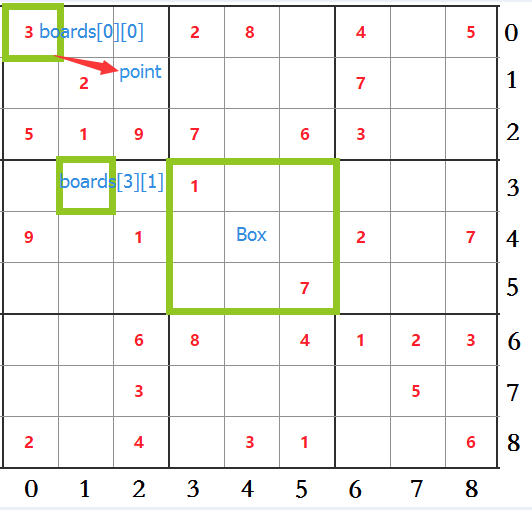
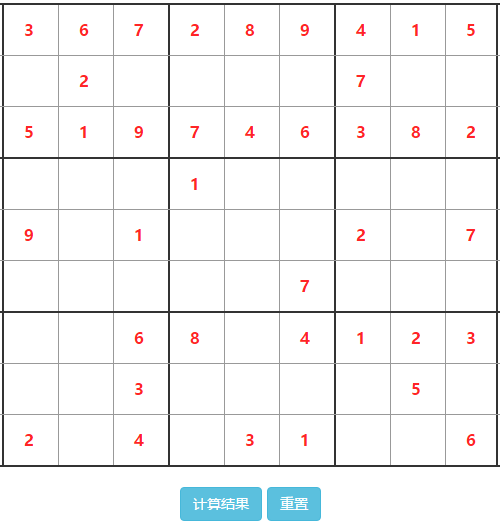
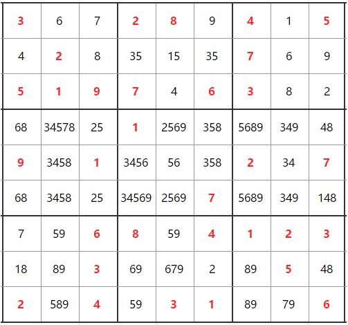

# Sudoku
> 用JavaScript实现数独算法

虽是个简单的算法实现，但还是发现自己的短板。比如：基础不扎实；平时工作多业务功能，缺乏对**编程**这块的理解学习。

# 简单说下 数独
历史大概：数独起源于瑞士，然后日本学者将其带回日本，改名sudoku，随后流行传播起来。

规则：根据9×9盘面上的已知数字，推理出所有剩余空格的数字，并满足每一行、每一列、每一个粗线宫（3*3）内的数字均含1-9，不重复。

附上图例：
- boards（面板）：大的9宫格
- point（坐标）：由oards[y][x]构成，共9*9个
- Box（块）：小9宫格，共9个




# 快速上手
启动服务：http://127.0.0.1:3000
````
npm run start 
````
运行jest测试用例
````
npm run test
````

# 说明
## 初始化数独面板


## 计算
1. 排除法（粗略计算）

    **boards[y][x]** 所在row,col,box出现的数字和1-9进行排除，余下唯一，则是改 **boards[y][x]** 的最终值

    ````
    for (let y = 0; y < 9; y++) {
        for (let x = 0; x < 9; x++) {
            let point = this.boards[y][x];
            // 排除 小9宫格
            this.removeDuplicateSquare(point)
            // 排除 横行
            this.removeDuplicateRow(point);
            // 排除 纵行
            this.removeDuplicateCol(point);
            // 校验
            this.validateSquare(point);
            this.validateRow(point);
            this.validateCol(point);
        }
    }
    ````
    
    下图：按照排除法，最终获取的面板

    

2. 回溯法（计算机死脑子，交给你吧）

    将上一方法最终未确定的坐标，组成一个cachePoints（候选坐标数组），依次遍历坐标数组中每个候选字（boards[1][3].candidateNums=[3,5]，假设[1][3].num=3），进行排除法，如果出错，则回归到上一个候选坐标，再继续遍历。直至全部算出。
    
    ````
    function oneByOnecandidateNumsCalc(){
        for (let i = currentIndex; i < cachePoints.length; i++) {
            var cachePoint = cachePoints[i];
            try {
                // 假设数值
                var num = cachePoint.candidateNums[cachePoint.tryTime];
                this.boards[cachePoint.col][cachePoint.row].num = num;
                // 排除法
                this.excludeCalc();
                // 记录历史面板
                this.oldBoard.push(this.getTempBoard(this.boards));
            } catch (err) {
                // 记录历史面板
                this.oldBoard.push(this.getTempBoard(this.boards));
                // 回退历史面板数据
                let currentI = this.goBackCachePoint(cachePoints, i);
                return this.oneByOnecandidateNumsCalc(currentI, cachePoints);
            }
        }
    }
    ````

3. 其他算法
    
    在**排除法**后，可以通过其他判断（区块摒除法、数对法...），进一步得到面板数据。使得**回溯法**的计算次数减少。这里就没有再次展开。

# 总结
断断续续花了好几天才硬算出数独，其实制定正确的程序后，交给计算机得出答案只是时间问题。但整个过程花了那么长时间，却反应出自己在这方面的欠缺。这里大致描述下完成这个Demo遇到的一些问题。如果理解有偏差，欢迎提issues

## 弹性布局
借这个机会使用了下flex，熟悉了下api

[可参考：flex 弹性布局](https://eminoda.github.io/2018/08/20/css-flex/)

## 闭包
为了创建出Sudoku对象后，就初始化好面板数据，而这个面板是贯穿全应用的，这里就引用了下闭包。
````
function Sudoku(originData) {
    this.boards = (function (Point) {
        let boards = [];
        for (let y = 0; y < 9; y++) {
            let line = []
            for (let x = 0; x < 9; x++) {
                line.push(new Point(x, y, originData[y][x]));
            }
            boards.push(line);
        }
        return boards;
    }(Point));
}
````
好处就是不用再执行什么init方法，直接获取boards即可拿到数据。**当然闭包不会释放引用，内存的消耗需要注意**

## 递归
````
Sudoku.prototype.oneByOnecandidateNumsCalc = function (currentIndex, cachePoints) {
    for (let i = currentIndex; i < cachePoints.length; i++) {
        var cachePoint = cachePoints[i];
        try {
            // 排除法
            this.excludeCalc();
        } catch (err) {
            ...
            return this.oneByOnecandidateNumsCalc(currentI, cachePoints);
        }
    }
}
````
在使用回溯法时，自然就想到了递归，但是由于*资质尚浅*居然忘记了定义**return**，导致本身就不怎么健全的方法，在无限循环下浏览器崩溃。一直怀疑是否程序写错了，结果只是因为没有return。

所以在使用递归时要注意几点：
- 如果需要获取返回值，记得添加上return
- 递归循环中，一定要有条件非法时，中断程序的逻辑。如果在业务代码里，就相当可怕。
- 复杂的逻辑尽量少使用递归，可能就会类似JS那种async callback hell，让代码难以理解。

## 引用
这个说起来很简单，初学编程都知道引用类型，数字类型的区别，但是在实际编程中却**忽略了**，不是一行行debug还真的发现不了。比如：oldBoard（历史面板数据）本身就作为类似快照恢复的功能，但再次使用时却发生了变化。

如何解决：
引用了lodash，只是为了实现deep copy功能
````
return _.cloneDeep(boards);
````

这里举例说明：
````
var oldArr = [];
var newVal = {name:1};
oldArr.push(newVal);
var newVal2 = newVal;
newVal2.name = 2;
oldArr[0].name; //2
````

# 感谢
感谢Tom 建议我实践下这个数独小游戏。脱离繁琐的业务功能迭代，带来的却是真实的编程体验。

